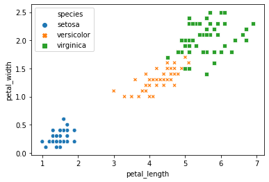

# 第1章 向量和向量空间

## 1.1 向量

### 1.1.1 描述向量


```python
import numpy as np
u = np.array([1, 6, 7])
u
```


    array([1, 6, 7])


```python
v = u.reshape(-1,1)
v
```


    array([[1],
           [6],
           [7]])


```python
import random, time

# 创建一个列表
lst = [random.randint(1, 100) for i in range(100000)]


start = time.time()
lst2 = [i*i for i in lst]    # 用列表解析的方式计算每个数的平方
end = time.time()
print(f"列表解析用时： {end - start}s")

vlst = np.array(lst)    # 将列表转换为数组表示的向量
start2 = time.time()
vlst2 = vlst * vlst    # 用数组相乘计算每个数的平方
end2 = time.time()
print(f"数组（向量）运算用时：{end2 - start2}s")
print(f"列表解析的运算时间是向量运算时间的：{round((end-start)/(end2-start2), 3)}倍")
```

    列表解析用时： 0.005980014801025391s
    数组（向量）运算用时：0.0001800060272216797s
    列表解析的运算时间是向量运算时间的：33.221倍
    


```python
from sklearn.feature_extraction.text import CountVectorizer  
vectorizer=CountVectorizer()                                              # (1)
corpus=["mathematics machine learn", "learn python learn mathematics"]    # (2)
cor_vec = vectorizer.fit_transform(corpus)                                # (3)
vectorizer.get_feature_names()                                            # (4)
```


    ['learn', 'machine', 'mathematics', 'python']


```python
print(cor_vec)
```

      (0, 2)	1
      (0, 1)	1
      (0, 0)	1
      (1, 2)	1
      (1, 0)	2
      (1, 3)	1
    


```python
import pandas as pd
df = pd.DataFrame(cor_vec.toarray(), columns=vectorizer.get_feature_names())
df
```


<div>
<style scoped>
    .dataframe tbody tr th:only-of-type {
        vertical-align: middle;
    }

    .dataframe tbody tr th {
        vertical-align: top;
    }

    .dataframe thead th {
        text-align: right;
    }
</style>
<table border="1" class="dataframe">
  <thead>
    <tr style="text-align: right;">
      <th></th>
      <th>learn</th>
      <th>machine</th>
      <th>mathematics</th>
      <th>python</th>
    </tr>
  </thead>
  <tbody>
    <tr>
      <th>0</th>
      <td>1</td>
      <td>1</td>
      <td>1</td>
      <td>0</td>
    </tr>
    <tr>
      <th>1</th>
      <td>2</td>
      <td>0</td>
      <td>1</td>
      <td>1</td>
    </tr>
  </tbody>
</table>
</div>


```python
from sklearn.feature_extraction.text import TfidfTransformer

tfidf_trans = TfidfTransformer()
tfidf = tfidf_trans.fit_transform(cor_vec)

# 每个字词的idf
tfidf_trans.idf_
```


    array([1.        , 1.40546511, 1.        , 1.40546511])


```python
tfidf.toarray()
```


    array([[0.50154891, 0.70490949, 0.50154891, 0.        ],
           [0.75726441, 0.        , 0.37863221, 0.53215436]])


### 1.1.2 向量的加法


```python
import numpy as np
np.array([[2],[1]]) + np.array([[3], [3]])
```


    array([[5],
           [4]])


```python
np.array([[2],[1]]) - np.array([[3], [3]])
```


    array([[-1],
           [-2]])


### 1.1.3 向量的数量乘法


```python
2 * np.array([[3], [1]])
```


    array([[6],
           [2]])


```python
-1 * np.array([[3], [1]])
```


    array([[-3],
           [-1]])


## 1.2 向量空间

### 1.2.3 线性无关


```python
df = pd.DataFrame({'A':[1,2,3],'B':[2,4,6],'C':[4,8,12],'target':[1,0,1]})
df
```


<div>
<style scoped>
    .dataframe tbody tr th:only-of-type {
        vertical-align: middle;
    }

    .dataframe tbody tr th {
        vertical-align: top;
    }

    .dataframe thead th {
        text-align: right;
    }
</style>
<table border="1" class="dataframe">
  <thead>
    <tr style="text-align: right;">
      <th></th>
      <th>A</th>
      <th>B</th>
      <th>C</th>
      <th>target</th>
    </tr>
  </thead>
  <tbody>
    <tr>
      <th>0</th>
      <td>1</td>
      <td>2</td>
      <td>4</td>
      <td>1</td>
    </tr>
    <tr>
      <th>1</th>
      <td>2</td>
      <td>4</td>
      <td>8</td>
      <td>0</td>
    </tr>
    <tr>
      <th>2</th>
      <td>3</td>
      <td>6</td>
      <td>12</td>
      <td>1</td>
    </tr>
  </tbody>
</table>
</div>


```python
df = pd.read_csv("./datasets/train.csv")
df_parts = df[['Survived', 'Sex', 'Age', 'Fare']]  # 获取部分特征
df_parts.head()
```


<div>
<style scoped>
    .dataframe tbody tr th:only-of-type {
        vertical-align: middle;
    }

    .dataframe tbody tr th {
        vertical-align: top;
    }

    .dataframe thead th {
        text-align: right;
    }
</style>
<table border="1" class="dataframe">
  <thead>
    <tr style="text-align: right;">
      <th></th>
      <th>Survived</th>
      <th>Sex</th>
      <th>Age</th>
      <th>Fare</th>
    </tr>
  </thead>
  <tbody>
    <tr>
      <th>0</th>
      <td>0</td>
      <td>male</td>
      <td>22.0</td>
      <td>7.2500</td>
    </tr>
    <tr>
      <th>1</th>
      <td>1</td>
      <td>female</td>
      <td>38.0</td>
      <td>71.2833</td>
    </tr>
    <tr>
      <th>2</th>
      <td>1</td>
      <td>female</td>
      <td>26.0</td>
      <td>7.9250</td>
    </tr>
    <tr>
      <th>3</th>
      <td>1</td>
      <td>female</td>
      <td>35.0</td>
      <td>53.1000</td>
    </tr>
    <tr>
      <th>4</th>
      <td>0</td>
      <td>male</td>
      <td>35.0</td>
      <td>8.0500</td>
    </tr>
  </tbody>
</table>
</div>


```python
df_parts.info()
```

    <class 'pandas.core.frame.DataFrame'>
    RangeIndex: 891 entries, 0 to 890
    Data columns (total 4 columns):
     #   Column    Non-Null Count  Dtype  
    ---  ------    --------------  -----  
     0   Survived  891 non-null    int64  
     1   Sex       891 non-null    object 
     2   Age       714 non-null    float64
     3   Fare      891 non-null    float64
    dtypes: float64(2), int64(1), object(1)
    memory usage: 28.0+ KB
    


```python
pd.get_dummies(df_parts[['Sex']]).head()
```


<div>
<style scoped>
    .dataframe tbody tr th:only-of-type {
        vertical-align: middle;
    }

    .dataframe tbody tr th {
        vertical-align: top;
    }

    .dataframe thead th {
        text-align: right;
    }
</style>
<table border="1" class="dataframe">
  <thead>
    <tr style="text-align: right;">
      <th></th>
      <th>Sex_female</th>
      <th>Sex_male</th>
    </tr>
  </thead>
  <tbody>
    <tr>
      <th>0</th>
      <td>0</td>
      <td>1</td>
    </tr>
    <tr>
      <th>1</th>
      <td>1</td>
      <td>0</td>
    </tr>
    <tr>
      <th>2</th>
      <td>1</td>
      <td>0</td>
    </tr>
    <tr>
      <th>3</th>
      <td>1</td>
      <td>0</td>
    </tr>
    <tr>
      <th>4</th>
      <td>0</td>
      <td>1</td>
    </tr>
  </tbody>
</table>
</div>


```python
df_parts['Male'] = pd.get_dummies(df_parts[['Sex']], drop_first=True)
df_parts.head()
```


<div>
<style scoped>
    .dataframe tbody tr th:only-of-type {
        vertical-align: middle;
    }

    .dataframe tbody tr th {
        vertical-align: top;
    }

    .dataframe thead th {
        text-align: right;
    }
</style>
<table border="1" class="dataframe">
  <thead>
    <tr style="text-align: right;">
      <th></th>
      <th>Survived</th>
      <th>Sex</th>
      <th>Age</th>
      <th>Fare</th>
      <th>Male</th>
    </tr>
  </thead>
  <tbody>
    <tr>
      <th>0</th>
      <td>0</td>
      <td>male</td>
      <td>22.0</td>
      <td>7.2500</td>
      <td>1</td>
    </tr>
    <tr>
      <th>1</th>
      <td>1</td>
      <td>female</td>
      <td>38.0</td>
      <td>71.2833</td>
      <td>0</td>
    </tr>
    <tr>
      <th>2</th>
      <td>1</td>
      <td>female</td>
      <td>26.0</td>
      <td>7.9250</td>
      <td>0</td>
    </tr>
    <tr>
      <th>3</th>
      <td>1</td>
      <td>female</td>
      <td>35.0</td>
      <td>53.1000</td>
      <td>0</td>
    </tr>
    <tr>
      <th>4</th>
      <td>0</td>
      <td>male</td>
      <td>35.0</td>
      <td>8.0500</td>
      <td>1</td>
    </tr>
  </tbody>
</table>
</div>


## 1.3 基和维数

### 1.3.3 维数


```python
import numpy as np

u = np.array([2, 3, 4])
u.ndim
```


    1


```python
u2 = np.array([[2], [3], [4]])
u2.ndim
```


    2


```python
a = np.arange(12).reshape((3, 4))
a
```


    array([[ 0,  1,  2,  3],
           [ 4,  5,  6,  7],
           [ 8,  9, 10, 11]])


```python
a.ndim
```


    2


```python
import seaborn as sns
iris = sns.load_dataset('iris')
iris.sample(2)
```


<div>
<style scoped>
    .dataframe tbody tr th:only-of-type {
        vertical-align: middle;
    }

    .dataframe tbody tr th {
        vertical-align: top;
    }

    .dataframe thead th {
        text-align: right;
    }
</style>
<table border="1" class="dataframe">
  <thead>
    <tr style="text-align: right;">
      <th></th>
      <th>sepal_length</th>
      <th>sepal_width</th>
      <th>petal_length</th>
      <th>petal_width</th>
      <th>species</th>
    </tr>
  </thead>
  <tbody>
    <tr>
      <th>137</th>
      <td>6.4</td>
      <td>3.1</td>
      <td>5.5</td>
      <td>1.8</td>
      <td>virginica</td>
    </tr>
    <tr>
      <th>99</th>
      <td>5.7</td>
      <td>2.8</td>
      <td>4.1</td>
      <td>1.3</td>
      <td>versicolor</td>
    </tr>
  </tbody>
</table>
</div>


## 1.4 内积空间

### 1.4.2 点积和欧几里得空间


```python
import numpy as np
a = np.array([3,5,7])
b = np.array([2,4,0])
np.dot(a, b)
```


    26


```python
np.inner(a, b)
```


    26


```python
c = np.array([[1,2], [3,4]])
d = np.array([[5,6], [7,8]])
np.dot(c, d)
```


    array([[19, 22],
           [43, 50]])


```python
np.inner(c, d)
```


    array([[17, 23],
           [39, 53]])


## 1.5 距离和角度

### 1.5.1 距离


```python
import numpy as np
vec1 = np.array([1, 2])
vec2 = np.array([9, 8])
dist = np.linalg.norm(vec1 - vec2)
print(dist)
```

    10.0
    


```python
from scipy.spatial.distance import cityblock

a = np.array([2,3,4])
b = np.array([9,8,7])
md = cityblock(a, b)
md
```


    15


### 1.5.2 基于距离的分类


```python
import seaborn as sns
import pandas as pd
import numpy as np

iris = sns.load_dataset('iris')
seto1 = iris.iloc[7]
seto2 = iris.iloc[28]
vers = iris.iloc[72]
df = pd.DataFrame([seto1, seto2, vers])
df
```


<div>
<style scoped>
    .dataframe tbody tr th:only-of-type {
        vertical-align: middle;
    }

    .dataframe tbody tr th {
        vertical-align: top;
    }

    .dataframe thead th {
        text-align: right;
    }
</style>
<table border="1" class="dataframe">
  <thead>
    <tr style="text-align: right;">
      <th></th>
      <th>sepal_length</th>
      <th>sepal_width</th>
      <th>petal_length</th>
      <th>petal_width</th>
      <th>species</th>
    </tr>
  </thead>
  <tbody>
    <tr>
      <th>7</th>
      <td>5.0</td>
      <td>3.4</td>
      <td>1.5</td>
      <td>0.2</td>
      <td>setosa</td>
    </tr>
    <tr>
      <th>28</th>
      <td>5.2</td>
      <td>3.4</td>
      <td>1.4</td>
      <td>0.2</td>
      <td>setosa</td>
    </tr>
    <tr>
      <th>72</th>
      <td>6.3</td>
      <td>2.5</td>
      <td>4.9</td>
      <td>1.5</td>
      <td>versicolor</td>
    </tr>
  </tbody>
</table>
</div>


```python
X = df.iloc[:,:-1]    # 得到除了标签特征 species 之外的数据

# 两个 setosa 间的距离
dist_seto = np.linalg.norm(X.iloc[1] - X.iloc[0])
dist_seto
```


    0.22360679774997916


```python
# versicolor 与一个 setosa 的距离
dist_vers = np.linalg.norm(X.iloc[2] - X.iloc[0])
dist_vers
```


    3.968626966596886


```python
sns.scatterplot(data=iris, x="petal_length", y="petal_width", hue="species", style="species")
```


    <matplotlib.axes._subplots.AxesSubplot at 0x7fb8e07b65e0>


    

    


```python
from sklearn.datasets import load_iris  #鸢尾花是经典的数据集，很多库都集成
from sklearn.neighbors import KNeighborsClassifier  # 引入k-NN模型

iris = load_iris()
X = iris.data
y = iris.target

knn_l1 = KNeighborsClassifier(p=1)    # 基于曼哈顿距离
knn_l2 = KNeighborsClassifier(p=2)    # 基于欧几里得距离

# 训练模型
knn_l1.fit(X, y)
knn_l2.fit(X, y)
```


    KNeighborsClassifier(algorithm='auto', leaf_size=30, metric='minkowski',
                         metric_params=None, n_jobs=None, n_neighbors=5, p=2,
                         weights='uniform')


```python
flower_l1 = knn_l1.predict([[2.7, 5.2, 6.3, 0.2]])
flower_l2 = knn_l2.predict([[2.7, 5.2, 6.3, 0.2]])
flower_l1_name = iris.target_names[flower_l1]
flower_l2_name = iris.target_names[flower_l2]

print("the instance [2.7, 5.2, 6.3, 0.2] is:")
print(flower_l1_name.item(), " by Manhattan Distance;")
print(flower_l2_name.item(), " by Euclidean Distance.")
```

    the instance [2.7, 5.2, 6.3, 0.2] is:
    virginica  by Manhattan Distance;
    versicolor  by Euclidean Distance.
    

### 1.5.3 范数和正则化


```python
import numpy as np
a = np.array([[3], [4]])
L1 = np.linalg.norm(a, ord=1)
print(L1)
```

    7.0
    


```python
L2 = np.linalg.norm(a)
L2
```


    5.0


### 1.5.4 角度


```python
import numpy as np
from scipy.spatial.distance import cosine

a = np.array([1,0,0])
b = np.array([0,1,0])
cosine(a, b)
```


    1.0


```python

```
