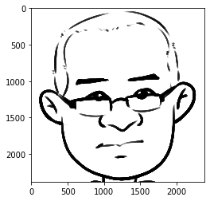
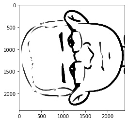
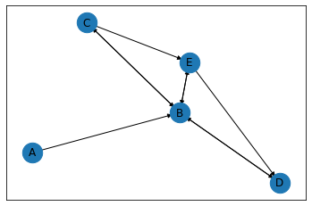

# 第2章 矩阵

## 2.1 基础知识

### 2.1.1 矩阵


```python
import numpy as np

matrix_I = np.array([[1, 0, 0], [0, 1, 0], [0, 0, 1]])
matrix_I
```


    array([[1, 0, 0],
           [0, 1, 0],
           [0, 0, 1]])


```python
np.mat("1 2 3; 4 5 6; 7 8 9")
```


    matrix([[1, 2, 3],
            [4, 5, 6],
            [7, 8, 9]])


```python
np.eye(3, dtype=int)
```


    array([[1, 0, 0],
           [0, 1, 0],
           [0, 0, 1]])


### 2.1.2 初等变换


```python
from sympy.matrices import Matrix
A = Matrix([[1,3,5],[2,4,6]])
A
```


$\displaystyle \left[\begin{matrix}1 & 3 & 5\\2 & 4 & 6\end{matrix}\right]$


```python
Arref, Apivots = A.rref()
print(f'简化阶梯矩阵：{Arref}')
print(f'主元：{Apivots}')
```

    简化阶梯矩阵：Matrix([[1, 0, -1], [0, 1, 2]])
    主元：(0, 1)
    

### 2.1.3 矩阵加法


```python
a = np.array([[1,4,6], [8,9,10]])
b = np.array([[2,3,5], [7,11,13]])
a + b
```


    array([[ 3,  7, 11],
           [15, 20, 23]])


```python
np.mat('1 4 6; 8 9 10') + np.mat('2 3 5; 7 11 13')
```


    matrix([[ 3,  7, 11],
            [15, 20, 23]])


```python
c = np.array([1, 2, 3]) 
d = np.array([[7],[8]])
c + d
```


    array([[ 8,  9, 10],
           [ 9, 10, 11]])


### 2.1.4 数量乘法


```python
2 * np.array([[1,4,6], [8,9,10]])
```


    array([[ 2,  8, 12],
           [16, 18, 20]])


```python
2 * np.mat('1 4 6; 8 9 10')
```


    matrix([[ 2,  8, 12],
            [16, 18, 20]])


### 2.1.5 矩阵乘法


```python
a = np.array([[1, 2],[4, 5]])
b = np.array([[2, 3],[7, 11]])
a * b
```


    array([[ 2,  6],
           [28, 55]])


```python
c = np.array([[1, 2],[4, 5]])
d = np.array([[2, 3, 5],[7, 11, 13]])
np.dot(c, d)   # 或者 a.dot(b)
```


    array([[16, 25, 31],
           [43, 67, 85]])


```python
A = np.mat('1 2; 4 5')
B = np.mat('2 3 5; 7 11 13')
A * B
```


    matrix([[16, 25, 31],
            [43, 67, 85]])


```python
M = np.mat('1 -2; -1 0')
np.power(M, 4)
```


    matrix([[ 1, 16],
            [ 1,  0]])


```python
from numpy.linalg import matrix_power
matrix_power(M, 4)
```


    matrix([[ 11, -10],
            [ -5,   6]])


## 2.2 线性映射

### 2.2.4 齐次坐标系


```python
%matplotlib inline
import matplotlib.pyplot as plt
from PIL import Image
image = Image.open("./images/2-2-12.png")
plt.imshow(image)
```


    <matplotlib.image.AxesImage at 0x7fa6a0676130>


    

    


```python
plt.imshow(image.rotate(90))
```


    <matplotlib.image.AxesImage at 0x7fa6891d7bb0>


    

    


## 2.3 矩阵的逆和转置

### 2.3.1 逆矩阵


```python
import numpy as np
a = np.array([[0.299, 0.587, 0.114], [-0.147, -0.289, 0.436], [0.615, -0.515, -0.1]])
a
```


    array([[ 0.299,  0.587,  0.114],
           [-0.147, -0.289,  0.436],
           [ 0.615, -0.515, -0.1  ]])


```python
from numpy.linalg import inv
np.round(inv(a), 3)
```


    array([[ 1.   , -0.   ,  1.14 ],
           [ 1.   , -0.395, -0.581],
           [ 1.   ,  2.032, -0.   ]])


### 2.3.2 转置矩阵


```python
A = np.mat('2 3 5; 7 11 13')
A
```


    matrix([[ 2,  3,  5],
            [ 7, 11, 13]])


```python
A.T
```


    matrix([[ 2,  7],
            [ 3, 11],
            [ 5, 13]])


```python
np.transpose(np.array([[2,3,5],[7,11,13]]))
```


    array([[ 2,  7],
           [ 3, 11],
           [ 5, 13]])


### 2.3.3 矩阵 LU 分解


```python
import pprint
from scipy.linalg import lu

A = np.array([ [7, 3, -1, 2], [3, 8, 1, -4], [-1, 1, 4, -1], [2, -4, -1, 6] ])
P, L, U = lu(A)

print("A:")
pprint.pprint(A)

print("P:")
pprint.pprint(P)

print("L:")
pprint.pprint(L)

print("U:")
pprint.pprint(U)
```

    A:
    array([[ 7,  3, -1,  2],
           [ 3,  8,  1, -4],
           [-1,  1,  4, -1],
           [ 2, -4, -1,  6]])
    P:
    array([[1., 0., 0., 0.],
           [0., 1., 0., 0.],
           [0., 0., 1., 0.],
           [0., 0., 0., 1.]])
    L:
    array([[ 1.        ,  0.        ,  0.        ,  0.        ],
           [ 0.42857143,  1.        ,  0.        ,  0.        ],
           [-0.14285714,  0.21276596,  1.        ,  0.        ],
           [ 0.28571429, -0.72340426,  0.08982036,  1.        ]])
    U:
    array([[ 7.        ,  3.        , -1.        ,  2.        ],
           [ 0.        ,  6.71428571,  1.42857143, -4.85714286],
           [ 0.        ,  0.        ,  3.55319149,  0.31914894],
           [ 0.        ,  0.        ,  0.        ,  1.88622754]])
    

## 2.4 行列式及应用

### 2.4.1 行列式


```python
import numpy as np 
a = np.array([[6,1,1], [4, -2, 5], [2,8,7]])   # 以二维数组表示矩阵
np.linalg.det(a) 
```


    -306.0


### 2.4.2 线性方程组


```python
A = np.mat("-1 3 -5; 2 -2 4;1 3 0")    # 系数矩阵
b = np.mat("-3 8, 6").T                # 常数项矩阵

r = np.linalg.solve(A,b)               # 调用 solve 函数求解
print(r)
```

    [[ 4.5]
     [ 0.5]
     [-0. ]]
    


```python
A = np.mat("1 3 -4 2;3 -1 2 -1;-2 4 -1 3;3 0 -7 6")
b = np.mat("0 0 0 0").T

r = np.linalg.solve(A, b)
print(r)
```

    [[ 0.]
     [ 0.]
     [-0.]
     [ 0.]]
    


```python
from sympy import *
from sympy.solvers.solveset import linsolve
x1, x2, x3, x4 = symbols("x1 x2 x3 x4")
linsolve([x1 + 3*x2 - 4*x3 + 2*x4, 3*x1 - x2 + 2*x3 - x4, -2*x1 + 4*x2 - x3 + 3*x4, 3*x1 +9*x2 - 7*x3 + 6*x4], (x1, x2, x3, x4))
```


$\displaystyle \left\{\left( \frac{x_{4}}{10}, \  - \frac{7 x_{4}}{10}, \  0, \  x_{4}\right)\right\}$


# 2.5 矩阵的秩


```python
import numpy as np
T = np.mat("2 3 5; 5 7 11; 13 17 21")
A = np.mat("1 0 0; 0 1 0; 0 0 0")
T2 = A * T
```


```python
rank_T = np.linalg.matrix_rank(T)
rank_A = np.linalg.matrix_rank(A)
rank_T2 = np.linalg.matrix_rank(T2)
print(f"rank(T)={rank_T}")
print(f"rank(A)={rank_A}")
print(f"rank(AT)={rank_T2}")
```

    rank(T)=3
    rank(A)=2
    rank(AT)=2
    


```python
# 设置Numpy中所有浮点数保留小数点后4位
np.set_printoptions(precision=4, suppress=True)

# 创建一个10×3的数组对象，表示矩阵
trend = np.linspace(0, 1, 10)
X = np.ones((10, 3))
X[:, 0] = trend
X[:, 1] = trend ** 2
X
```


    array([[0.    , 0.    , 1.    ],
           [0.1111, 0.0123, 1.    ],
           [0.2222, 0.0494, 1.    ],
           [0.3333, 0.1111, 1.    ],
           [0.4444, 0.1975, 1.    ],
           [0.5556, 0.3086, 1.    ],
           [0.6667, 0.4444, 1.    ],
           [0.7778, 0.6049, 1.    ],
           [0.8889, 0.7901, 1.    ],
           [1.    , 1.    , 1.    ]])


```python
np.linalg.matrix_rank(X)
```


    3


```python
np.corrcoef(X[:,0], X[:, 1])
```


    array([[1.    , 0.9627],
           [0.9627, 1.    ]])


```python
Y = np.zeros((10, 4))
Y[:, :3] = X
Y[:, 3] = np.dot(X, [-1, 0.5, 0.5])   # 用np.dot()增加第4列
Y
```


    array([[0.    , 0.    , 1.    , 0.5   ],
           [0.1111, 0.0123, 1.    , 0.3951],
           [0.2222, 0.0494, 1.    , 0.3025],
           [0.3333, 0.1111, 1.    , 0.2222],
           [0.4444, 0.1975, 1.    , 0.1543],
           [0.5556, 0.3086, 1.    , 0.0988],
           [0.6667, 0.4444, 1.    , 0.0556],
           [0.7778, 0.6049, 1.    , 0.0247],
           [0.8889, 0.7901, 1.    , 0.0062],
           [1.    , 1.    , 1.    , 0.    ]])


```python
np.linalg.matrix_rank(Y)
```


    3


## 2.6 稀疏矩阵

### 稀疏矩阵压缩


```python
import numpy as np
from scipy.sparse import csr_matrix

m = csr_matrix((3, 8), dtype=np.int8)
m
```


    <3x8 sparse matrix of type '<class 'numpy.int8'>'
    	with 0 stored elements in Compressed Sparse Row format>


```python
m.toarray()
```


    array([[0, 0, 0, 0, 0, 0, 0, 0],
           [0, 0, 0, 0, 0, 0, 0, 0],
           [0, 0, 0, 0, 0, 0, 0, 0]], dtype=int8)


```python
row = np.array([0, 0, 2])
col = np.array([0, 2, 2])
data = np.array([1, 2, 3])
m2 = csr_matrix((data, (row, col)), shape=(3, 8))
m2
```


    <3x8 sparse matrix of type '<class 'numpy.longlong'>'
    	with 3 stored elements in Compressed Sparse Row format>


```python
m2.toarray()
```


    array([[1, 0, 2, 0, 0, 0, 0, 0],
           [0, 0, 0, 0, 0, 0, 0, 0],
           [0, 0, 3, 0, 0, 0, 0, 0]], dtype=int64)


```python
T = np.array([[1,1,0,0,0,0,0,0], [1,1,1,1,1,1,0,0], [0,0,0,2,1,0,2,1]])
csr_T = csr_matrix(T)
csr_T
```


    <3x8 sparse matrix of type '<class 'numpy.longlong'>'
    	with 12 stored elements in Compressed Sparse Row format>


```python
csr_T.indices
```


    array([0, 1, 0, 1, 2, 3, 4, 5, 3, 4, 6, 7], dtype=int32)


```python
csr_T.indptr
```


    array([ 0,  2,  8, 12], dtype=int32)


```python
csr_T.data
```


    array([1, 1, 1, 1, 1, 1, 1, 1, 2, 1, 2, 1], dtype=int64)


## 2.7 图与矩阵

### 2.7.2 有向图和邻接矩阵


```python
!pip3 install networkx
```

    Collecting networkx
      Downloading networkx-2.5-py3-none-any.whl (1.6 MB)
         |████████████████████████████████| 1.6 MB 49 kB/s eta 0:00:014
    [?25hRequirement already satisfied: decorator>=4.3.0 in /Library/Frameworks/Python.framework/Versions/3.8/lib/python3.8/site-packages (from networkx) (4.4.2)
    Installing collected packages: networkx
    Successfully installed networkx-2.5
    WARNING: You are using pip version 20.3.1; however, version 20.3.3 is available.
    You should consider upgrading via the '/Library/Frameworks/Python.framework/Versions/3.8/bin/python3 -m pip install --upgrade pip' command.
    


```python
import networkx as nx
G = nx.DiGraph()
G.add_edges_from([('A','B'),('B','C'),('B','D'),('B','E'),('C','B'),('C','E'),('D','B'),('E','B'),('E','D')])
```


```python
%matplotlib inline
import matplotlib.pyplot as plt
pos = nx.spring_layout(G)
nx.draw_networkx_nodes(G, pos, cmap=plt.get_cmap('jet'), node_size = 500)
nx.draw_networkx_labels(G, pos)
nx.draw_networkx_edges(G, pos,arrows=True)
```


    [<matplotlib.patches.FancyArrowPatch at 0x7fa68e519820>,
     <matplotlib.patches.FancyArrowPatch at 0x7fa68e4f9d30>,
     <matplotlib.patches.FancyArrowPatch at 0x7fa69dee2b80>,
     <matplotlib.patches.FancyArrowPatch at 0x7fa68e519fd0>,
     <matplotlib.patches.FancyArrowPatch at 0x7fa68e519f10>,
     <matplotlib.patches.FancyArrowPatch at 0x7fa68e52d490>,
     <matplotlib.patches.FancyArrowPatch at 0x7fa68e52d6d0>,
     <matplotlib.patches.FancyArrowPatch at 0x7fa68e52d910>,
     <matplotlib.patches.FancyArrowPatch at 0x7fa68e52db50>]


    

    


```python
G_A = nx.adjacency_matrix(G)
G_A
```


    <5x5 sparse matrix of type '<class 'numpy.longlong'>'
    	with 9 stored elements in Compressed Sparse Row format>


```python
nx.to_numpy_matrix(G)
```


    matrix([[0., 1., 0., 0., 0.],
            [0., 0., 1., 1., 1.],
            [0., 1., 0., 0., 1.],
            [0., 1., 0., 0., 0.],
            [0., 1., 0., 1., 0.]])


```python
import numpy as np
A = np.mat("0 1 0 1 1; 0 0 1 0 0; 0 0 0 0 0; 0 1 1 0 0; 0 0 0 1 0")
A
```


    matrix([[0, 1, 0, 1, 1],
            [0, 0, 1, 0, 0],
            [0, 0, 0, 0, 0],
            [0, 1, 1, 0, 0],
            [0, 0, 0, 1, 0]])


```python
A * A
```


    matrix([[0, 1, 2, 1, 0],
            [0, 0, 0, 0, 0],
            [0, 0, 0, 0, 0],
            [0, 0, 1, 0, 0],
            [0, 1, 1, 0, 0]])


```python
A * A * A
```


    matrix([[0, 1, 2, 0, 0],
            [0, 0, 0, 0, 0],
            [0, 0, 0, 0, 0],
            [0, 0, 0, 0, 0],
            [0, 0, 1, 0, 0]])


```python
A * A * A * A
```


    matrix([[0, 0, 1, 0, 0],
            [0, 0, 0, 0, 0],
            [0, 0, 0, 0, 0],
            [0, 0, 0, 0, 0],
            [0, 0, 0, 0, 0]])


```python
A * A * A * A * A
```


    matrix([[0, 0, 0, 0, 0],
            [0, 0, 0, 0, 0],
            [0, 0, 0, 0, 0],
            [0, 0, 0, 0, 0],
            [0, 0, 0, 0, 0]])


### 2.7.3 关联矩阵


```python
import networkx as nx
nodes = [1, 2, 3, 4, 5]
edges = [[1, 2], [1, 4], [2, 5], [3, 1], [5, 3], [5, 4]]
D = nx.DiGraph()
D.add_nodes_from(nodes)
D.add_edges_from(edges)
```


```python
M = nx.incidence_matrix(D, oriented=True)
M
```


    <5x6 sparse matrix of type '<class 'numpy.float64'>'
    	with 12 stored elements in Compressed Sparse Column format>


```python
A = M.todense()
A
```


    matrix([[-1., -1.,  0.,  1.,  0.,  0.],
            [ 1.,  0., -1.,  0.,  0.,  0.],
            [ 0.,  0.,  0., -1.,  1.,  0.],
            [ 0.,  1.,  0.,  0.,  0.,  1.],
            [ 0.,  0.,  1.,  0., -1., -1.]])


### 2.7.4 拉普拉斯矩阵


```python
nodes = [1,2,3,4]
edges = [(1,2),(1,3),(1,4),(3,4)]
G = nx.Graph()
G.add_nodes_from(nodes)
G.add_edges_from(edges)

L = nx.laplacian_matrix(G)
L.todense()
```


    matrix([[ 3, -1, -1, -1],
            [-1,  1,  0,  0],
            [-1,  0,  2, -1],
            [-1,  0, -1,  2]], dtype=int64)


```python

```
