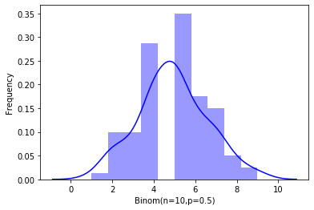
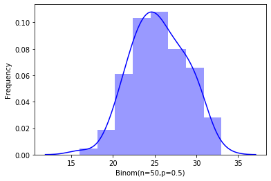
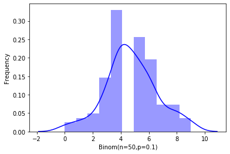

# 第5章 概率论

## 5.3 随机变量概率分布

### 5.3.2 离散型随机变量的分布


```python
from sklearn.datasets import load_iris
from sklearn.linear_model import LogisticRegression

X, y = load_iris(return_X_y=True)
clf = LogisticRegression(random_state=0)
clf.fit(X, y)
```

    /Library/Frameworks/Python.framework/Versions/3.8/lib/python3.8/site-packages/sklearn/linear_model/_logistic.py:938: ConvergenceWarning: lbfgs failed to converge (status=1):
    STOP: TOTAL NO. of ITERATIONS REACHED LIMIT.
    
    Increase the number of iterations (max_iter) or scale the data as shown in:
        https://scikit-learn.org/stable/modules/preprocessing.html
    Please also refer to the documentation for alternative solver options:
        https://scikit-learn.org/stable/modules/linear_model.html#logistic-regression
      n_iter_i = _check_optimize_result(
    


    LogisticRegression(C=1.0, class_weight=None, dual=False, fit_intercept=True,
                       intercept_scaling=1, l1_ratio=None, max_iter=100,
                       multi_class='auto', n_jobs=None, penalty='l2',
                       random_state=0, solver='lbfgs', tol=0.0001, verbose=0,
                       warm_start=False)


```python
clf.predict(X[:2, :])
```


    array([0, 0])


```python
%matplotlib inline
import seaborn as sns
import numpy as np
from scipy.stats import binom
data_binom = binom.rvs(size=100, n=3, p=0.5)
print(data_binom)
```

    [2 3 2 1 2 1 2 1 3 2 2 0 2 1 2 2 2 2 1 2 2 3 1 1 2 0 0 1 2 3 1 1 1 2 2 1 2
     1 0 3 2 2 2 1 3 2 2 2 1 1 1 2 2 1 2 2 2 1 3 1 1 1 2 0 1 1 2 1 2 0 1 0 2 2
     2 1 1 0 1 2 2 1 2 1 2 1 0 3 1 1 1 2 2 1 3 0 2 2 2 2]
    


```python
ax = sns.distplot(data_binom, kde=True, color='blue')
ax.set(xlabel='Binom(n=3,p=0.5)', ylabel='Frequency')
```


    [Text(0, 0.5, 'Frequency'), Text(0.5, 0, 'Binom(n=3,p=0.5)')]


    

    


```python
data_binom = binom.rvs(size=100, n=10, p=0.5)
ax = sns.distplot(data_binom, kde=True, color='blue')
ax.set(xlabel='Binom(n=10,p=0.5)', ylabel='Frequency')
```


    [Text(0, 0.5, 'Frequency'), Text(0.5, 0, 'Binom(n=10,p=0.5)')]


    

    


```python
data_binom = binom.rvs(size=100, n=50, p=0.5)
ax = sns.distplot(data_binom, kde=True, color='blue')
ax.set(xlabel='Binom(n=50,p=0.5)', ylabel='Frequency')
```


    [Text(0, 0.5, 'Frequency'), Text(0.5, 0, 'Binom(n=50,p=0.5)')]


    

    


```python
data_binom = binom.rvs(size=100, n=100, p=0.5)
ax = sns.distplot(data_binom, kde=True, color='blue')
ax.set(xlabel='Binom(n=100,p=0.5)', ylabel='Frequency')
```


    [Text(0, 0.5, 'Frequency'), Text(0.5, 0, 'Binom(n=100,p=0.5)')]


    

    


```python
data_binom = binom.rvs(size=100, n=3, p=0.1)
ax = sns.distplot(data_binom, kde=True, color='blue')
ax.set(xlabel='Binom(n=3,p=0.1)', ylabel='Frequency')
```


    [Text(0, 0.5, 'Frequency'), Text(0.5, 0, 'Binom(n=3,p=0.1)')]


    

    


```python
data_binom = binom.rvs(size=100, n=10, p=0.1)
ax = sns.distplot(data_binom, kde=True, color='blue')
ax.set(xlabel='Binom(n=10,p=0.1)', ylabel='Frequency')
```


    [Text(0, 0.5, 'Frequency'), Text(0.5, 0, 'Binom(n=10,p=0.1)')]


    

    


```python
data_binom = binom.rvs(size=100, n=50, p=0.1)
ax = sns.distplot(data_binom, kde=True, color='blue')
ax.set(xlabel='Binom(n=50,p=0.1)', ylabel='Frequency')
```


    [Text(0, 0.5, 'Frequency'), Text(0.5, 0, 'Binom(n=50,p=0.1)')]


    

    


```python
data_binom = binom.rvs(size=100, n=100, p=0.1)
ax = sns.distplot(data_binom, kde=True, color='blue')
ax.set(xlabel='Binom(n=100,p=0.1)', ylabel='Frequency')
```


    [Text(0, 0.5, 'Frequency'), Text(0.5, 0, 'Binom(n=100,p=0.1)')]


    

    


```python
from scipy.stats import poisson

data_poisson = poisson.rvs(mu=3, size=10000)    # 根据泊松分布生成数据
ax = sns.distplot(data_poisson, bins=30, kde=False, color='blue')
ax.set(xlabel="Poisson", ylabel='Frequency')
```


    [Text(0, 0.5, 'Frequency'), Text(0.5, 0, 'Poisson')]


    

    


```python
data_poisson = poisson.rvs(mu=6, size=10000)
ax = sns.distplot(data_poisson, bins=30, kde=False, color='blue')
ax.set(xlabel="Poisson", ylabel='Frequency')
```


    [Text(0, 0.5, 'Frequency'), Text(0.5, 0, 'Poisson')]


    

    


### 5.3.3 连续型随机变量的分布


```python
%matplotlib inline
from scipy.stats import uniform
import seaborn as sns

data_uniform = uniform.rvs(size=10000, loc=0, scale=10)
```


```python
ax = sns.distplot(data_uniform, bins=100, kde=True, color='blue')
ax.set(xlabel='Uniform', ylabel='Frequency')
```


    [Text(0, 0.5, 'Frequency'), Text(0.5, 0, 'Uniform')]


    

    


```python
from scipy.stats import expon
import seaborn as sns

data_expon = expon.rvs(size=10000)
ax = sns.distplot(data_expon, kde=True, color='blue')
ax.set(xlabel='Expon', ylabel='Frequency')
```


    [Text(0, 0.5, 'Frequency'), Text(0.5, 0, 'Expon')]


    

    


```python
import numpy as np
import seaborn as sns

mu, sigma = 0, 1
data_norm = np.random.normal(mu, sigma, 10000)
ax = sns.distplot(data_norm, kde=True, color='blue')
```


    

    


```python
from scipy.stats import norm
for i in [1,2,3]:
    prob = norm.cdf(i) - norm.cdf(-i)
    prob = round(prob*100, 2) 
    print(f"P(mu - {i}sigma < X < mu +{i}sigma) = {prob}%")
```

    P(mu - 1sigma < X < mu +1sigma) = 68.27%
    P(mu - 2sigma < X < mu +2sigma) = 95.45%
    P(mu - 3sigma < X < mu +3sigma) = 99.73%
    


```python
import numpy as np
import seaborn as sns
ax = sns.distplot(np.random.pareto(a=1.16,size=1000), hist=True, kde=True)
ax.set(xlabel='Pareto', ylabel='Frequency')
```


    [Text(0, 0.5, 'Frequency'), Text(0.5, 0, 'Pareto')]


    

    


```python
from scipy.stats import pareto
alpha = 1.16
xmin = 1000
incomes = pareto(b=alpha, scale=xmin)
```


```python
incomes.median()
```


    1817.6431200757233


```python
incomes.mean()
```


    7250.000000000004


```python
top_ratio= 1 - incomes.cdf(incomes.mean())
print(f'{round(top_ratio*100, 2)}%')
```

    10.05%
    

### 5.3.4 多维随机变量及其分布


```python
import numpy as np
data_mult = np.random.multinomial(n=20, pvals=[1/6.] * 6, size=(2, 3))
data_mult
```


    array([[[2, 3, 5, 2, 4, 4],
            [1, 4, 3, 6, 5, 1],
            [1, 2, 1, 2, 5, 9]],
    
           [[2, 3, 6, 2, 3, 4],
            [2, 3, 4, 4, 3, 4],
            [2, 3, 5, 4, 4, 2]]])


```python
from scipy.stats import multinomial
p = [1.0/3.0, 1.0/3.0, 1.0/3.0]
n = 100
dist = multinomial(n, p)
```


```python
cases = [33, 33, 34]
pr = dist.pmf(cases)
pr = round(pr*100, 2)
print(f'Case={cases}, Probability: {pr}%')
```

    Case=[33, 33, 34], Probability: 0.81%
    

## 5.5 随机变量的数字特征

### 5.5.1 数学期望


```python
import numpy as np

X1 = np.random.binomial(1000, 0.5, 1)
X2 = np.random.binomial(1000, 0.5, 1)
X3 = np.random.binomial(1000, 0.5, 1)
X4 = np.random.binomial(1000, 0.5, 1)
X5 = np.random.binomial(1000, 0.5, 1)
X6 = np.random.binomial(1000, 0.5, 1)
X7 = np.random.binomial(1000, 0.5, 1)
X8 = np.random.binomial(1000, 0.5, 1)
X9 = np.random.binomial(1000, 0.5, 1)
X10 = np.random.binomial(1000, 0.5, 1)
X11 = np.random.binomial(1000, 0.5, 1)
X12 = np.random.binomial(1000, 0.5, 1)
X13 = np.random.binomial(1000, 0.5, 1)
X14 = np.random.binomial(1000, 0.5, 1)
X15 = np.random.binomial(1000, 0.5, 1)

X_mean = (X1 + X2 + X3 + X4 + X5 + X6 + X7 + X8+ X9 + X10 + X11 + X12 + X13 + X14 + X15)/15 
X_mean
```


    array([496.4])


```python
np.mean([X1,X2,X3,X4,X5,X6,X7,X8,X9,X10,X11,X12,X13,X14,X15])
```


    496.4


```python
from scipy.stats import binom

binom.mean(1000, 0.5)  # 创建 n=1000, p=0.5 的二项分布，并计算均值
```


    500.0


```python
a = np.array([[1, 2], [3, 4]])

m = np.mean(a)
m0 = np.mean(a, axis=0)
m1 = np.mean(a, axis=1)

print(f"mean of all: {m}")
print(f"mean of 0 axis: {m0}")
print(f"mean of 1 axis: {m1}")
```

    mean of all: 2.5
    mean of 0 axis: [2. 3.]
    mean of 1 axis: [1.5 3.5]
    


```python
mu, sigma = 0, 1
binom.mean(mu, sigma)
```


    0.0


```python
data_norm = np.random.normal(mu, sigma, 10000)
np.mean(data_norm)
```


    -0.0102349464736911


### 5.5.2 方差和协方差


```python
import numpy as np
from sklearn import datasets
from sklearn.preprocessing import StandardScaler

iris = datasets.load_iris()
iris_std = StandardScaler().fit_transform(iris.data)

mean_iris_std = np.mean(iris_std, axis=0)
var_iris_std = np.var(iris_std, axis=0)

print(f"the mean is {mean_iris_std} after stardard scaler.")
print(f"the variance is {var_iris_std} after stardard scaler." )
```

    the mean is [-1.69031455e-15 -1.84297022e-15 -1.69864123e-15 -1.40924309e-15] after stardard scaler.
    the variance is [1. 1. 1. 1.] after stardard scaler.
    


```python
%matplotlib inline
import numpy as np
import matplotlib.pyplot as plt
import seaborn as sns

mu1, sigma1 = 0, 1
mu2, sigma2 = 0, 2
mu3, sigma3 = 0, 0.5

d1 = np.random.normal(mu1, sigma1, 10000)
d2 = np.random.normal(mu2, sigma2, 10000)
d3 = np.random.normal(mu3, sigma3, 10000)

ax1 = sns.distplot(d1, label='sigma1')
ax2 = sns.distplot(d2, label='sigma2')
ax3 = sns.distplot(d3, label='sigma3')

plt.legend()
```


    <matplotlib.legend.Legend at 0x7fa8ca6e22e0>


    

    


### 5.5.3 计算相似度


```python
import pandas as pd

df = pd.DataFrame({'IQ':[106, 86, 100, 101, 99, 103, 97, 113, 112, 110], 
                   'Hours_TV': [7, 0, 27, 50, 28, 29, 20, 12, 6, 17]})
df.corr(method='spearman')
```


<div>
<style scoped>
    .dataframe tbody tr th:only-of-type {
        vertical-align: middle;
    }

    .dataframe tbody tr th {
        vertical-align: top;
    }

    .dataframe thead th {
        text-align: right;
    }
</style>
<table border="1" class="dataframe">
  <thead>
    <tr style="text-align: right;">
      <th></th>
      <th>IQ</th>
      <th>Hours_TV</th>
    </tr>
  </thead>
  <tbody>
    <tr>
      <th>IQ</th>
      <td>1.000000</td>
      <td>-0.175758</td>
    </tr>
    <tr>
      <th>Hours_TV</th>
      <td>-0.175758</td>
      <td>1.000000</td>
    </tr>
  </tbody>
</table>
</div>


```python
df.corr(method='kendall')
```


<div>
<style scoped>
    .dataframe tbody tr th:only-of-type {
        vertical-align: middle;
    }

    .dataframe tbody tr th {
        vertical-align: top;
    }

    .dataframe thead th {
        text-align: right;
    }
</style>
<table border="1" class="dataframe">
  <thead>
    <tr style="text-align: right;">
      <th></th>
      <th>IQ</th>
      <th>Hours_TV</th>
    </tr>
  </thead>
  <tbody>
    <tr>
      <th>IQ</th>
      <td>1.000000</td>
      <td>-0.111111</td>
    </tr>
    <tr>
      <th>Hours_TV</th>
      <td>-0.111111</td>
      <td>1.000000</td>
    </tr>
  </tbody>
</table>
</div>


```python
from scipy.spatial import distance
distance.jaccard([1, 0, 0], [0, 1, 0])
```


    1.0


```python
distance.jaccard([1, 0, 0], [1, 1, 1])
```


    0.6666666666666666


```python

```
