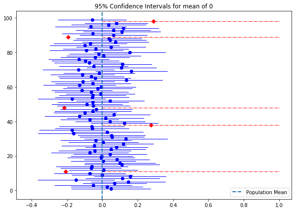
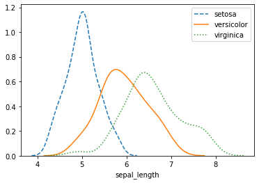

# 第6章 数理统计

## 6.3 区间估计


```python
import numpy as np

np.random.seed(8899)   # 生成随机数的种子，能够保证每次执行本程序，都生成同样的随机数
n = 100
samples = [np.random.normal(loc=0, scale=1, size=100) for _ in range(n)]
```


```python
%matplotlib inline
import matplotlib.pyplot as plt
from scipy import stats 
fig, ax = plt.subplots(figsize=(10, 7))

for i in np.arange(1, n, 1):
    sample_mean = np.mean(samples[i])    # 样本均值
    se = stats.sem(samples[i])           # 样本标准差
    sample_ci = stats.norm.interval(0.95, sample_mean, se)    # 置信水平为0.95的置信区间
    # 绘制置信区间和样本均值
    if ((sample_ci[0] <= 0) and (0 <= sample_ci[1])):
        plt.plot((sample_ci[0], sample_ci[1]), (i, i), color='blue', linewidth=1)
        plt.plot(np.mean(samples[i]), i, 'bo')
    else:
        plt.plot(sample_ci[0], sample_ci[1], (i, i), color='red', linewidth=1, linestyle='-.')
        plt.plot(np.mean(samples[i]), i, color='red', marker='D')

plt.axvline(x=0, ymin=0, ymax=1, linestyle="--", linewidth=2, label='Population Mean')
plt.legend(loc='best')
plt.title('95% Confidence Intervals for mean of 0')
```


    Text(0.5, 1.0, '95% Confidence Intervals for mean of 0')


    

    


```python
from scipy import stats
import numpy as np
stats.norm.interval(0.95, loc=1.20, scale=1/np.sqrt(16))
```


    (0.7100090038649864, 1.6899909961350135)


## 6.4 参数检验

### 6.4.1 基本概念


```python
import seaborn as sns
iris = sns.load_dataset('iris')
setosa = iris[iris['species']=='setosa']['sepal_length']
versicolor = iris[iris['species']=='versicolor']['sepal_length']
virginica = iris[iris['species']=='virginica']['sepal_length']
sns.distplot(setosa, kde=True, hist=False,label='setosa', kde_kws={"linestyle":"--"})
sns.distplot(versicolor, kde=True, hist=False, label='versicolor', kde_kws={"linestyle":"-"})
sns.distplot(virginica, kde=True, hist=False, label='virginica', kde_kws={"linestyle":":"})
```


    <matplotlib.axes._subplots.AxesSubplot at 0x7f8c7eb581f0>


    

    


```python
setosa.describe()
```


    count    50.00000
    mean      5.00600
    std       0.35249
    min       4.30000
    25%       4.80000
    50%       5.00000
    75%       5.20000
    max       5.80000
    Name: sepal_length, dtype: float64


### 6.4.2 正态总体均值的假设检验


```python
from statsmodels.stats.weightstats import ztest
ztest(setosa, value=4.5)
```


    (10.150538987647847, 3.295383521651256e-24)


```python
import numpy as np
from scipy import stats
from statsmodels.stats.weightstats import DescrStatsW as smstat

np.random.seed(7654567)
rvs = stats.norm.rvs(loc=5, scale=10, size=(50, 2))    # 创建服从正态分布的观测数据

smstat(rvs).ttest_mean([5.0, 0.0])
```


    (array([-0.68014479,  4.11038784]),
     array([4.99613833e-01, 1.49986458e-04]),
     49.0)


```python
from scipy import stats
stats.ttest_1samp(rvs,[5.0,0.0])
```


    Ttest_1sampResult(statistic=array([-0.68014479,  4.11038784]), pvalue=array([4.99613833e-01, 1.49986458e-04]))


```python
import numpy as np
from scipy import stats

np.random.seed(728)

rvs1 = stats.norm.rvs(loc=5, scale=10, size=500)    # 生成两个服从正态分布的观测数据
rvs2 = stats.norm.rvs(loc=8, scale=20, size=100)

stats.ttest_ind(rvs1, rvs2, equal_var = False)    # equal_var=False，即总体标准差不同
```


    Ttest_indResult(statistic=-1.3731744943633437, pvalue=0.1725630411434839)


```python
r = [0.30, 0.23, 0.41, 0.53, 0.24, 0.36, 0.38, 0.51]    # 人对红光的反应时间
g = [0.43, 0.32, 0.58, 0.46, 0.27, 0.41, 0.38, 0.61]    # 人对绿光的反应时间
```


```python
stats.ttest_rel(r, g)
```


    Ttest_relResult(statistic=-2.311250817605121, pvalue=0.05408703689705545)


### 6.4.5 用假设检验比较模型


```python
from sklearn.linear_model import LogisticRegression
from sklearn.tree import DecisionTreeClassifier
from mlxtend.data import iris_data
from sklearn.model_selection import train_test_split


X, y = iris_data()
model1 = LogisticRegression(random_state=1)
model2 = DecisionTreeClassifier(random_state=1)

X_train, X_test, y_train, y_test = train_test_split(X, y, test_size=0.25, random_state=123)

score1 = model1.fit(X_train, y_train).score(X_test, y_test)
score2 = model2.fit(X_train, y_train).score(X_test, y_test)

print(f'Logistic regression accuracy: {score1*100:.2f}%')
print(f'Decision tree accuracy: {score2*100:.2f}%')
```

    Logistic regression accuracy: 97.37%
    Decision tree accuracy: 94.74%
    


```python
from mlxtend.evaluate import paired_ttest_5x2cv
t, p = paired_ttest_5x2cv(estimator1=model1, estimator2=model2, X=X, y=y, scoring='accuracy', random_seed=1)

print(f'P-value: {p:.3f}, t-Statistic: {t:.3f}')

if p <= 0.05:
    print('Difference between mean performance is probably real')
else:
    print('Algorithms probably have the same performance')
```

    /Library/Frameworks/Python.framework/Versions/3.8/lib/python3.8/site-packages/sklearn/linear_model/_logistic.py:938: ConvergenceWarning: lbfgs failed to converge (status=1):
    STOP: TOTAL NO. of ITERATIONS REACHED LIMIT.
    
    Increase the number of iterations (max_iter) or scale the data as shown in:
        https://scikit-learn.org/stable/modules/preprocessing.html
    Please also refer to the documentation for alternative solver options:
        https://scikit-learn.org/stable/modules/linear_model.html#logistic-regression
      n_iter_i = _check_optimize_result(
    /Library/Frameworks/Python.framework/Versions/3.8/lib/python3.8/site-packages/sklearn/linear_model/_logistic.py:938: ConvergenceWarning: lbfgs failed to converge (status=1):
    STOP: TOTAL NO. of ITERATIONS REACHED LIMIT.
    
    Increase the number of iterations (max_iter) or scale the data as shown in:
        https://scikit-learn.org/stable/modules/preprocessing.html
    Please also refer to the documentation for alternative solver options:
        https://scikit-learn.org/stable/modules/linear_model.html#logistic-regression
      n_iter_i = _check_optimize_result(
    /Library/Frameworks/Python.framework/Versions/3.8/lib/python3.8/site-packages/sklearn/linear_model/_logistic.py:938: ConvergenceWarning: lbfgs failed to converge (status=1):
    STOP: TOTAL NO. of ITERATIONS REACHED LIMIT.
    
    Increase the number of iterations (max_iter) or scale the data as shown in:
        https://scikit-learn.org/stable/modules/preprocessing.html
    Please also refer to the documentation for alternative solver options:
        https://scikit-learn.org/stable/modules/linear_model.html#logistic-regression
      n_iter_i = _check_optimize_result(
    

    P-value: 1.000, t-Statistic: 0.000
    Algorithms probably have the same performance
    

    /Library/Frameworks/Python.framework/Versions/3.8/lib/python3.8/site-packages/sklearn/linear_model/_logistic.py:938: ConvergenceWarning: lbfgs failed to converge (status=1):
    STOP: TOTAL NO. of ITERATIONS REACHED LIMIT.
    
    Increase the number of iterations (max_iter) or scale the data as shown in:
        https://scikit-learn.org/stable/modules/preprocessing.html
    Please also refer to the documentation for alternative solver options:
        https://scikit-learn.org/stable/modules/linear_model.html#logistic-regression
      n_iter_i = _check_optimize_result(
    


```python
model3 = DecisionTreeClassifier(max_depth=1)
score3 = model3.fit(X_train, y_train).score(X_test, y_test)

print(f'Decision tree accuracy: {score3*100:.2f}%')

t, p = paired_ttest_5x2cv(estimator1=model1, estimator2=model3, X=X, y=y, scoring='accuracy', random_seed=1)

print(f'P-value: {p:.3f}, t-Statistic: {t:.3f}')

if p <= 0.05:
    print('Difference between mean performance is probably real')
else:
    print('Algorithms probably have the same performance')
```

    Decision tree accuracy: 63.16%
    

    /Library/Frameworks/Python.framework/Versions/3.8/lib/python3.8/site-packages/sklearn/linear_model/_logistic.py:938: ConvergenceWarning: lbfgs failed to converge (status=1):
    STOP: TOTAL NO. of ITERATIONS REACHED LIMIT.
    
    Increase the number of iterations (max_iter) or scale the data as shown in:
        https://scikit-learn.org/stable/modules/preprocessing.html
    Please also refer to the documentation for alternative solver options:
        https://scikit-learn.org/stable/modules/linear_model.html#logistic-regression
      n_iter_i = _check_optimize_result(
    /Library/Frameworks/Python.framework/Versions/3.8/lib/python3.8/site-packages/sklearn/linear_model/_logistic.py:938: ConvergenceWarning: lbfgs failed to converge (status=1):
    STOP: TOTAL NO. of ITERATIONS REACHED LIMIT.
    
    Increase the number of iterations (max_iter) or scale the data as shown in:
        https://scikit-learn.org/stable/modules/preprocessing.html
    Please also refer to the documentation for alternative solver options:
        https://scikit-learn.org/stable/modules/linear_model.html#logistic-regression
      n_iter_i = _check_optimize_result(
    /Library/Frameworks/Python.framework/Versions/3.8/lib/python3.8/site-packages/sklearn/linear_model/_logistic.py:938: ConvergenceWarning: lbfgs failed to converge (status=1):
    STOP: TOTAL NO. of ITERATIONS REACHED LIMIT.
    
    Increase the number of iterations (max_iter) or scale the data as shown in:
        https://scikit-learn.org/stable/modules/preprocessing.html
    Please also refer to the documentation for alternative solver options:
        https://scikit-learn.org/stable/modules/linear_model.html#logistic-regression
      n_iter_i = _check_optimize_result(
    

    P-value: 0.001, t-Statistic: 7.269
    Difference between mean performance is probably real
    

    /Library/Frameworks/Python.framework/Versions/3.8/lib/python3.8/site-packages/sklearn/linear_model/_logistic.py:938: ConvergenceWarning: lbfgs failed to converge (status=1):
    STOP: TOTAL NO. of ITERATIONS REACHED LIMIT.
    
    Increase the number of iterations (max_iter) or scale the data as shown in:
        https://scikit-learn.org/stable/modules/preprocessing.html
    Please also refer to the documentation for alternative solver options:
        https://scikit-learn.org/stable/modules/linear_model.html#logistic-regression
      n_iter_i = _check_optimize_result(
    

## 6.5 非参数检验

### 6.5.1 拟合优度检验


```python
from scipy.stats import chisquare
chisquare([1e10-1e6, 1e10+1.5e6, 1e10-2e6, 1e10+4e6, 1e10-3e6, 1e10+0.5e6])
```


    Power_divergenceResult(statistic=3250.0, pvalue=0.0)


```python
from scipy.stats import chi2
chi2.isf(0.05, (6-1))
```


    11.070497693516355


```python
p_value = 1 - chi2.cdf(3250.0, (6-1))
print(p_value)
```

    0.0
    


```python
from scipy.stats import poisson

pi = [poisson.pmf(k=i, mu=0.69) for i in range(0,3)]
p4 = 1 - sum(pi)
pi.append(p4)
print(pi)
```

    [0.5015760690660556, 0.3460874876555783, 0.11940018324117453, 0.032936260037191634]
    


```python
import numpy as np
chisquare([223, 142, 48, 19], f_exp=np.array(pi)*432, ddof=1)
```


    Power_divergenceResult(statistic=2.410235253667352, pvalue=0.2996567497654643)


```python
chi2.isf(0.05, (4-1-1))
```


    5.991464547107983


```python
p_value = 1 - chi2.cdf(2.41, (4-1-1))
print(p_value)
```

    0.2996919995132463
    

### 6.5.2 列链表检验


```python
from scipy.stats import chi2_contingency
import pandas as pd
df = pd.DataFrame({'smoker':[39,15],'no_smoker':[21,25]})
chi2_contingency(df, correction=False)
```


    (7.306763285024157,
     0.006869555272453766,
     1,
     array([[32.4, 27.6],
            [21.6, 18.4]]))


```python
from scipy.stats import chi2
chi2.isf(0.01, 1)
```


    6.634896601021217


```python
chisquare([223,142,48,19], f_exp=[0.502*432,0.346*432,0.119*432,0.033*432], ddof=2)
```


    Power_divergenceResult(statistic=2.351731742258605, pvalue=0.12514391755070803)


```python
chi2.isf(0.05, 2)
```


    5.991464547107983


```python
1-chi2.cdf(2.3517,2)
```


    0.30855659508453925


```python
chi_2 = chisquare([6,16,17,26,11,9,9,6], f_exp=[7.8,13.2, 18.5, 19.4, 16.3, 11.4, 6.9, 6.5], ddof=1)
chi_2
```


    Power_divergenceResult(statistic=6.282474470262367, pvalue=0.392302383997154)


```python
p_value = 1 - chi2.cdf(6.281, 6)
p_value
```


    0.39245964232646136


```python
chi_2
```


```python
mu = 4.2
```


```python
from scipy.stats import poisson
```


```python
poisson.pmf(k=0, mu=mu)
```


    0.014995576820477703


```python
poisson.pmf(k=2, mu=mu)
```


    0.13226098755661336


```python
poisson.pmf(k=3, mu=mu)
```


    0.1851653825792587


```python
pi = [poisson.pmf(k=i, mu=mu) for i in range(13)]
```


```python
npi = 100*np.array(pi)
```


```python
chisquare([1,5,16,17,26,11,9,9,2,1,2,1,0], f_exp=npi, ddof=1)
```


    Power_divergenceResult(statistic=11.71275332659663, pvalue=0.38561734563165234)


```python
p_value = 1 - chi2.cdf(11.7128, 13-1-1)
```


```python
p_value
```


    0.3856137138479808


```python
chisquare([1e10-1e6, 1e10+1.5e6, 1e10-2e6, 1e10+4e6, 1e10-3e6, 1e10+0.5e6], ddof=4)
```


    Power_divergenceResult(statistic=3250.0, pvalue=0.0)


```python
p_value = 1 - chi2.cdf(3250.0, 5)
print(p_value)
```

    0.0
    


```python
import numpy as np

f_i = np.array([1,5,16,17,26,11,9,9,2,1,2,1])
alpha = np.array([0,1,2,3,4,5,6,7,8,9,10,11])
alpha_mean = np.sum(f_i * alpha)/100
print(alpha_mean)
```

    4.2
    


```python
pi
```


    [0.014995576820477703,
     0.06298142264600638,
     0.13226098755661336,
     0.1851653825792587,
     0.19442365170822168,
     0.1633158674349063,
     0.11432110720443431,
     0.0685926643226606,
     0.03601114876939682,
     0.01680520275905187,
     0.007058185158801781,
     0.0026949434242697717,
     0.0009432301984944207]


```python
alpha = [0,1,2,3,4,5,6,7,8,9,10,11]

```


```python
total_alpha = np.array(f_i)*np.array(alpha)
total_alpha
```


    array([  0,   5,  32,  51, 104,  55,  54,  63,  16,   9,  20,  11])


```python
np.sum(total_alpha)/100
```


    4.2


```python
299/432
```


    0.6921296296296297


```python
from scipy.stats import poisson
import numpy as np

pi = [poisson.pmf(k=i, mu=0.69) for i in range(0,3)]
p4 = 1 - sum(pi)
pi.append(p4)
print(pi)
```

    [0.5015760690660556, 0.3460874876555783, 0.11940018324117453, 0.032936260037191634]
    


```python
import numpy as np
chisquare([223, 142, 48, 19], f_exp=np.array(pi)*432, ddof=1)
```


    Power_divergenceResult(statistic=2.410235253667352, pvalue=0.2996567497654643)


```python
chisquare([223,142,48,19], f_exp=[0.502*432,0.346*432,0.119*432,0.033*432], ddof=1)
```


    Power_divergenceResult(statistic=2.351731742258605, pvalue=0.308551697981783)


```python
np.array(pi)*432
```


    array([216.68086184, 149.50979467,  51.58087916,  14.22846434])


```python
[0.502*432,0.346*432,0.119*432,0.033*432]
```


    [216.864, 149.47199999999998, 51.408, 14.256]


```python
chi2.isf(0.05, (4-1-1))
```


    5.991464547107983


```python
p_value = 1 - chi2.cdf(2.41, (4-1-1))
print(p_value)
```

    0.2996919995132463
    


```python
from scipy.stats import chi2_contingency
```


```python
import pandas as pd
```


```python
from scipy.stats import chi2_contingency
import pandas as pd
df = pd.DataFrame({'smoker':[39,15],'no_smoker':[21,25]})
chi2_contingency(df, correction=False)
```


    (7.306763285024157,
     0.006869555272453766,
     1,
     array([[32.4, 27.6],
            [21.6, 18.4]]))


```python
chi2_contingency([[39,21],[15,25]], correction=False)
```


    (7.306763285024157,
     0.006869555272453766,
     1,
     array([[32.4, 27.6],
            [21.6, 18.4]]))


```python
df
```


<div>
<style scoped>
    .dataframe tbody tr th:only-of-type {
        vertical-align: middle;
    }

    .dataframe tbody tr th {
        vertical-align: top;
    }

    .dataframe thead th {
        text-align: right;
    }
</style>
<table border="1" class="dataframe">
  <thead>
    <tr style="text-align: right;">
      <th></th>
      <th>yes</th>
      <th>no</th>
    </tr>
  </thead>
  <tbody>
    <tr>
      <th>0</th>
      <td>39</td>
      <td>21</td>
    </tr>
    <tr>
      <th>1</th>
      <td>15</td>
      <td>25</td>
    </tr>
  </tbody>
</table>
</div>


```python
from scipy.stats import chi2
chi2.isf(0.01, 1)
```


    6.634896601021217


```python
p_value = 1 - chi2.cdf(7.3068, 1)
print(p_value)
```

    0.006869414912642924
    


```python
df = pd.DataFrame({'shou':[32,133],'normal':[40,121],'heavy':[59,106]})
chi2_contingency(df, correction=False)
```


    (11.705404438710113,
     0.002872127543874838,
     2,
     array([[ 44.02240326,  42.95519348,  44.02240326],
            [120.97759674, 118.04480652, 120.97759674]]))


```python

```
